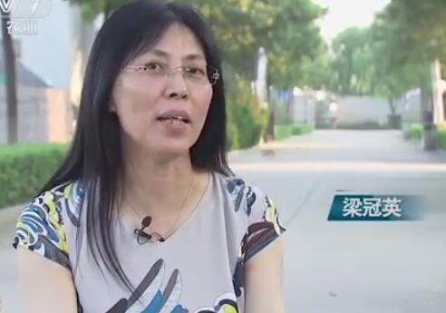

## **20181108期-梁冠英**

主人公：梁冠英 地区籍贯：山西省水县胡兰镇 
职业：原幼儿园老师，现在牛肉制品企业负责人 
现在成就：山西年4亿元收入的省级牛肉养殖加工龙头企业 
故事： 

1. 身边最开始的业务。
   接手丈夫家已经破产的牛肉制品加工厂
2. 第一桶金。
   接到陌生人一桩大单，需要一批价值80多W的牛里脊肉，并且要主人公家贴付货款，最后对方守信，3天后打钱。并且后续又向主人公家订了几批牛肉。
3. 调查市场。
   主人公主动去外省调查牛肉价格，发现外面几个省的牛肉价格比村里高很多倍，并由此引出牛肉精细分割业务,通过这个业务，肉的价格可以涨很多。
4. 一次失败的牛肉精细分割技术尝试。
   主人公组织村里进行牛肉精细分割,但没有参考同类竞品业务，发现产品口感太硬，无法获得食客认可。
5. 双赢合作。
   到天津寻找产品商，提出对方出技术和人员，主人公免费为对方收牛肉，免费出场地屠宰，免费出机器的合作方案，给别人留3000块的利润，自己只留下少许成本。一年合同下来获得市场认可的牛肉精细分割技术。
6. 研发多种产品占领牛肉市场。
   利用牛肉精细分割技术，把牛肉产品种类扩展到100多种,生肉和熟肉都有，并通过竞品分析，提供竞品无法达到的特色，如不会丢失水份的冷鲜西冷牛肉，省去解冻的步骤，提高了口感。
7. 建立养牛场的动机。
   2006年，主人公偶然读到一篇农业文章，上面说中国的牛肉比国际市场的要低很多，所以借钱办了一个产1W头肉牛的养牛场，为自己的牛肉加工厂生产稳定的牛肉来源。
8. 牛肉市场大获利。
   肉牛基地有10公里，并且本地产酒糟，利用酒糟养牛+桔杆养牛又是一大特色，2007年，牛肉市场价格长了整整一倍多。

总结：幸运没被人骗，主动了解市场不对称的信息，有人愿意借钱给他们家做生意，利用家乡资源，抓住市场机会，统筹资源致富。

---
