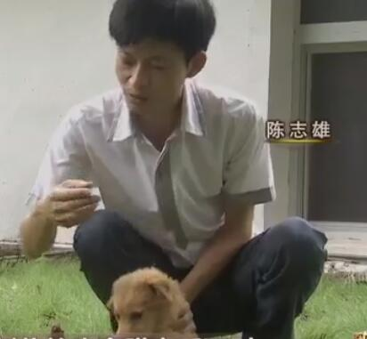

## **20181108期-梁冠英**

电视台记者 郭婧 ， 现场记者 邱燕妮

主人公：梁冠英 地区籍贯：山西省水县胡兰镇 
职业：原幼儿园老师，现在牛肉制品企业负责人 
现在成就：山西年4亿元收入的省级牛肉养殖加工龙头企业 
故事： 

1. 身边最开始的业务。 
   接手丈夫家已经破产的牛肉制品加工厂
2. 拼人品的第一桶金。 
   接到陌生人一桩大单，需要一批价值80多W的牛里脊肉，并且要主人公家贴付货款，最后对方守信，3天后打钱。并且后续又向主人公家订了几批牛肉。
3. 调查市场。 
   主人公主动去外省调查牛肉价格，发现外面几个省的牛肉价格比村里高很多倍，并由此引出牛肉精细分割业务,通过这个业务，肉的价格可以涨很多。
4. 一次失败的牛肉精细分割技术尝试。 
   主人公组织村里进行牛肉精细分割,但没有参考同类竞品业务，发现产品口感太硬，无法获得食客认可。
5. 双赢合作。 
   到天津寻找产品商，提出对方出技术和人员，主人公免费为对方收牛肉，免费出场地屠宰，免费出机器的合作方案，给别人留3000块的利润，自己只留下少许成本。一年合同下来获得市场认可的牛肉精细分割技术。
6. 研发多种产品占领牛肉市场。 
   利用牛肉精细分割技术，把牛肉产品种类扩展到100多种,生肉和熟肉都有，并通过竞品分析，提供竞品无法达到的特色，如不会丢失水份的冷鲜西冷牛肉，省去解冻的步骤，提高了口感。
7. 建立养牛场的动机。 
   2006年，主人公偶然读到一篇农业文章，上面说中国的牛肉比国际市场的要低很多，所以借钱办了一个产1W头肉牛的养牛场，为自己的牛肉加工厂生产稳定的牛肉来源。
8. 牛肉市场大获利。 
   肉牛基地有10公里，并且本地产酒糟，利用酒糟养牛+桔杆养牛又是一大特色，2007年，牛肉市场价格长了整整一倍多。

总结：幸运没被人骗，主动了解市场不对称的信息，有人愿意借钱给他们家做生意，利用家乡资源，抓住市场机会，统筹资源致富。

---

## **20181109期-陈志雄**

电视台记者 刘栋栋 ， 现场记者  程倩

主人公：陈志雄 
地区籍贯：福建省漳州市木棉村 职业：原建材店老板，豪猪农村养殖合作社负责人 
现在成就：年入上千万的豪猪农村养殖合作社 
故事： 

1. 养殖豪猪的动机。

   不想再过打牌过日子，而且建材生意也不见起色，于是放弃建材店生意，回家养殖豪猪。因为老家龙海有吃豪猪的习惯，但是并没有养殖豪猪的习惯，豪猪是杂食性动物，饲养成本低，但市场价格高。

2. 克服第一桶金碰到的第一个问题：缺乏营养

   主角集合12户养殖豪猪户，成立合作社，但在养殖过程中，豪猪得病死一部分，这个问题就是豪猪一样不能家养的原因。找当地农户一起上山找野生豪猪的生活习惯，研究为什么野生的豪猪不会得软脚病。多次调查发现，野生豪猪会自己上山吃药，而药是一种山上的土。后经畜牧专家分析，这种土富含多种对生物有益的微量元素。成员从12户变成25户。

3. 克服第一桶金碰到的第二个问题：存栏量太少

   因为新出生的小豪猪，会被年长豪猪咬死。安装摄像头，观察豪猪的行为，原来，豪猪是1公配二母，但母豪猪会把不是自己生的小豪猪偷偷给咬死。所以只能采用一公一母。

4. 克服第一桶金碰到的第三个问题：销售渠道

   因为主角不做低端零售给小餐饮，于是托做金融朋友，在电商平台出售豪猪肉，现场试吃，最后卖到160元一斤。现在销路有2种，1 电商 2 供给大酒店，并在包装里付上烹饪说明 3 特色寄养

总结:

因地制宜，利用前面做生意的存款，投资到了一条竞争少的空白市场，经过几次大的困难后，在当地农户和相关行业的朋友帮助下，幸运解决了养殖和销售的问题。

----

